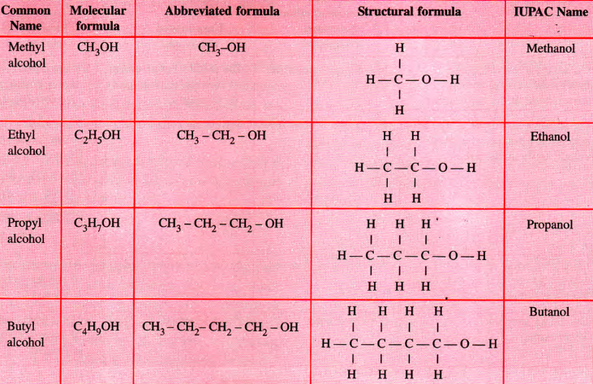
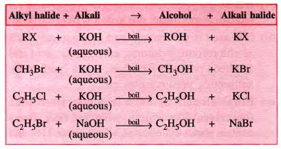

public:: true

- ## Definition
	- ### **Hydroxyl** derivatives of alkanes
	- ### Formed by **replacing one or more hydrogen atoms of the alkane** with $$\ce{-OH}$$ group
	- ### Can be **monohydric**, i.e. w/ one $$\ce{-OH}$$ attached to the Carbon atom, **dihydric** and **trihydric**
-
- {:height 320, :width 519}
-
- ## Ethanol
	- ### Lab Prep
		- Alcohol can be prepared by the **hydrolysis of alkyl halids** on a reaction w/ a hot dilute alkali
		- 
	- ### Industrial Method
		- #### Hydration of Ethene
			- $$\ce{C2H4 + H2SO4 ->[80C][30 ATM] C2H5HSO4}$$
			- $$\ce{C2H5HSO4 + H2O -> C2H5OH + H2SO4}$$
			- Alternatively, ethanol is produced when ethene is heated with water at 300C and 60ATM pressure in presence of phosphoric acid catalyst
			- $$\ce {C2H4 + H2O ->[\ce{H3PO4}][300C, 60 ATM] C2H5OH}$$
	- ### Properties of Alcohols
		-