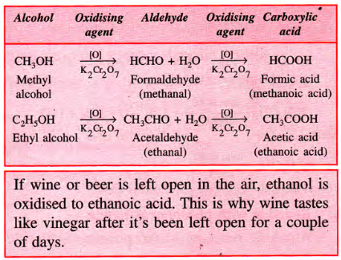
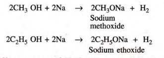
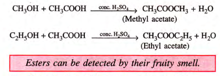
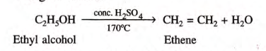
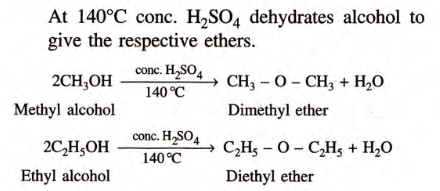
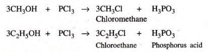

## Definition
	- ### **Hydroxyl** derivatives of alkanes
	- ### Formed by **replacing one or more hydrogen atoms of the alkane** with $$\ce{-OH}$$ group
	- ### Can be **monohydric**, i.e. w/ one $$\ce{-OH}$$ attached to the Carbon atom, **dihydric** and **trihydric**
-
- {:height 320, :width 519}
-
- ## Ethanol
	- ### Lab Prep
		- Alcohol can be prepared by the **hydrolysis of alkyl halids** on a reaction w/ a hot dilute alkali
		- 
	- ### Industrial Method
		- #### Hydration of Ethene
			- $$\ce{C2H4 + H2SO4 ->[80C][30 ATM] C2H5HSO4}$$
			- $$\ce{C2H5HSO4 + H2O -> C2H5OH + H2SO4}$$
			- Alternatively, ethanol is produced when ethene is heated with water at 300C and 60ATM pressure in presence of phosphoric acid catalyst
			- $$\ce {C2H4 + H2O ->[\ce{H3PO4}][300C, 60 ATM] C2H5OH}$$
	- ### Physical Properties of Alcohols
		- #### **Nature:**
			- They are inflammable volatile liquids.
		- #### **Boiling point:**
			- Their boiling point increases with an increase in molecular weight
			- **Examples:**
				- i. $$\ce{CH3OH}$$ = 64.5C
				- ii. $$\ce{CH3CH2OH}$$ = 78.3C
		- #### **Solubility:**
			- They are soluble in water as well as in organic solvents
		- #### **Density:**
			- Ethanol is lighter than water, its specific gravity is **0.79** at **293 K**
	- ### Chemical Properties
		- #### **Combustion**
			- Alcohol burns readily in air to produce $$\ce{CO2}$$ and Water Vapours
			- Reaction: $$\ce{C2H5OH + 3O2 -> 2CO2 + 3H2O + Heat}$$
			- Burns with a pale blue flame
		- #### **Oxidation w/ Acidified** $$\ce{K2Cr2O7}$$
			- Alcs react w/ oxidizing agents like these.
			- Because they supply **nascent oxygen [O]**, alcohols convert to **aldehydes** then to their acid forms
			- 
		- #### **Reaction w/ Na**
			- When Na reacts w/ **methanol** and **ethanol** at **room temperature**, **hydrogen** is evolved w/ the formation of **sodium methoxide** and **sodium ethoxide** respectively
			- 
			- Can be detected by effervescence of Hydrogen
		- #### **Reactions w/ Acetic Acid**
			- When alcs react w/ acetic acid in presence of conc. $$\ce{H2SO4}$$ at high temp
			- Their respective **esters** are produced, this process is thus known as **esterification**
			- 
		- ### **Dehydration**
			- #### **By Concentrated Sulfuric Acid**
				- 
				- {:height 193, :width 377}
			- #### **By Aluminium Oxide**
				- 
		- #### **Reaction with Phosporus Halide**
			- 