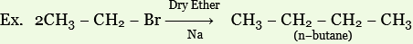
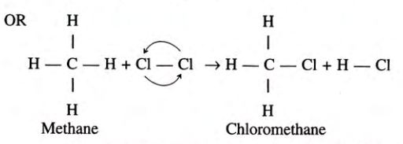
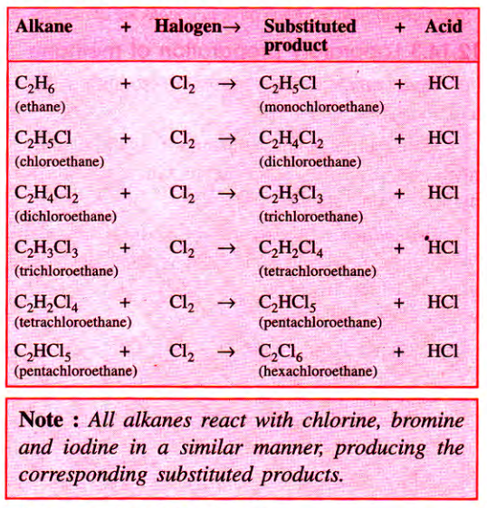
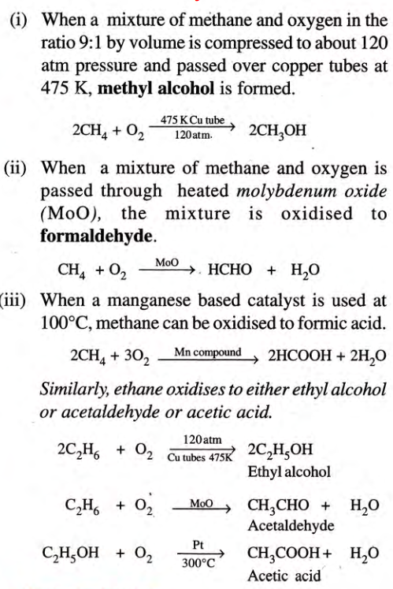
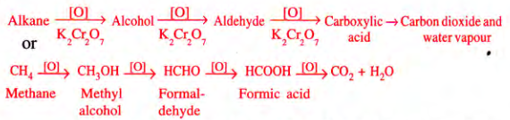

## Single Covalent Bonds
	- They are also known as saturated hydrocarbons, since all the four valencies of carbon are fully satisfied in the formula C_{n}H_{2n+2} by a single bond.
- ### Alkanes are also good fuels because they enter combustion reactions with oxygen.
- ## Isomerism in Alkanes
	- Alkanes with more than three carbon atoms form isomers. Usually, they are chain isomers.
	- 
-
- ### Occurrence of Methane and Ethane **(for exams)**
	- #### Ethane:
		- Occurs to the extent of 10% to 20% along with Methane.
	- #### Methane:
		- A.K.A. Marsh Gas, formed in the bottom of marshes due to fermentation of cellulose by a special bacteria
		- Present in air exhaled by animals on a cellulose-rich diet, and also in intestinal gases and blood of animals and humans
		- Cavities in coal contain 90% Methane, known as the **fire-damp**.
-
- ## Methane
	- ### Structure of Methane
		- 
		- Methane is **3-Dimensional**.
		- Four outer electrons in the carbon atom move as far apart as possible due to repulsion, causing the tetrahedron shape of the molecule.
-
	- ### Laboratory Preparation of Methane
		- **Reactants**: Sodium ethanoate (CH_{3}COONa) & CaO
		- **Procedure**: A mixture of Sodium ethanoate and soda lime is taken in a hard glass test tube and heated with a bunsen flame.
		- $$\ce {CH3COONa + NaOH ->[\ce{CaO}][\text 300C] CH4 + Na2CO3}$$
		- **Collection**: The gas is collected by downward displacement of water
	- ### Laboratory preparation of Ethane
		- $$\ce {C2H5COONa + NaOH ->[\ce{CaO}][\text 300C] C2H6 + Na2CO3}$$
		- **Collection**: Downward displacement of water
	- ### Wurtz Reaction **(for exam)**
		- 
	- ### Physical Properties
		- #### Methane:
			- It is a colourless and odourless gas.
			- Its boiling point is -162C and its melting point is -183C
			- It is negligibly soluble in water and soluble in organic solvents.
		- #### Ethane:
			- It is a colourless, odourless, tasteless, and non-poisonous gas.
			- Its boiling point is -89C and its melting point is -172C
			- It is sparingly soluble in water but wholly soluble in organic solvents like alcohols, acetone, and ether.
	- ### Chemical Properties
		- Methane and Ethane are **saturated hydrocarbons**.
		- They do not react with bases such as $$\ce {NaOH}$$ or with oxidising agents like $$\ce {KMnO4}$$ or with reducing agents like $$\ce {Na}$$.
		- They undergo substitution reactions as well as combustion reaction.
		- **Substitution Reaction**:
			- Reaction with **Halogens**:
				- Alkanes react with $$\ce {Cl}$$, $$\ce {Br}$$, or $$\ce {I}$$ in the presence of sunlight or ultraviolet light to give halogen substituted products, known as **alkyl halides**. These contain one or more halogen atoms.
				- **Methane** reacts with Chlorine in diffused sunlight or when heated to 600K, to give chloromethane.
				- $$\ce {CH4 + Cl2 ->T[diffused sunlight][or 600K] CH3Cl + HCl}$$
				- 
				- 
		- **Decomposition of alkanes**:
			- The decomposition of a compound by heat in the absence of air is called **Pyrolysis**. When it occurs, the process is called **cracking**.
			- The alkanes, on heating under high temperature or in the presence of a catalyst in absence of air are broken down into lower alkanes, alkenes, and hydrogen.
			- $$\ce {2CH4 ->T[1500C] HC\bond{#}CH + 3H2}$$
			- $$\ce {H3C\bond{-}CH3 ->T[500C][\ce{Al2O3}] H2C\bond{=}CH2 + H2}$$
			- $$\ce {C3H12 ->T[400C-600C][Alumina or Silica] C3H8 + C2H4}$$
			- $$\ce {C7H16 ->T[400C-600C][Alumina or Silica] C4H10 + C3H6}$$
		- **Catalytic Oxidation of Alkanes**:
			- 
		- **Slow Combustion**:
			- 
-