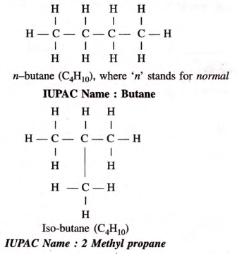
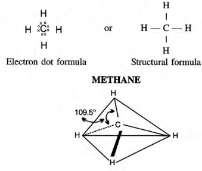

## Single Covalent Bonds
	- They are also known as saturated hydrocarbons, since all the four valencies of carbon are fully satisfied in the formula C_{n}H_{2n+2} by a single bond.
- ### Alkanes are also good fuels because they enter combustion reactions with oxygen.
- ## Isomerism in Alkanes
	- Alkanes with more than three carbon atoms form isomers. Usually, they are chain isomers.
	- 
-
- ### Occurrence of Methane and Ethane **(for exams)**
	- #### Ethane:
		- Occurs to the extent of 10% to 20% along with Methane.
	- #### Methane:
		- A.K.A. Marsh Gas, formed in the bottom of marshes due to fermentation of cellulose by a special bacteria
		- Present in air exhaled by animals on a cellulose-rich diet, and also in intestinal gases and blood of animals and humans
		- Cavities in coal contain 90% Methane, known as the **fire-damp**.
-
- ## Methane
	- ### Structure of Methane
		- 
		- Methane is **3-Dimensional**.
		- Four outer electrons in the carbon atom move as far apart as possible due to repulsion, causing the tetrahedron shape of the molecule.
-
	- ### Laboratory Preparation of Methane
		- **Reactants**: Sodium ethanoate (CH_{3}COONa) & CaO
		- **Procedure**: A mixture of Sodium ethanoate and soda lime is taken in a hard glass test tube and heated with a bunsen flame.
		- $$\ce {CH3COONa + NaOH ->[\ce{CaO}][\text 300C] CH4 + Na2CO3}$$
-
- ### Laboratory preparation of Ethane
	-