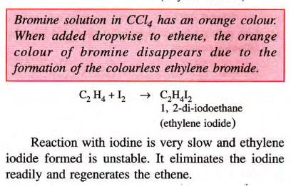

## Double Bond
	- Alkenes are **unsaturated** aliphatic [open-chain structure] hydrocarbons that contain one **double bond**
	- They are also called **olefins** [oil forming] because the lower members of alkenes form oily products when they are treated with $$\ce {Cl}$$ or $$\ce {Br}$$. Alkenes form a homologous series having the general formula $$\ce {CnH2n}$$
	- 
	- Isomers in Alkene form when there are 4 or more carbon atoms.
-
- ## Ethene
	- ### Structure of Ethene
		- It is the first member of the alkene series. It is present in natural gas. In small amounts, it occurs as a plant hormone and is responsible for the ripening of fruits.
		- Each carbon atom of ethene is attached to two hydrogen atoms by single covalent bonds and to another carbon atom by a double covalent bond.
		- There are four $$\ce {C\bond{-}H}$$ single covalent bonds and one $$\ce {C\bond{=}H}$$ double covalent bond. It is a planar molecule. All bond angles ($$\ce {H\bond{-}C\bond{-}H}$$ and $$\ce {H\bond{-}C\bond{=}C}$$) are of 120 degrees.
		  
	- ### Preparation of Ethene
		- #### Dehydration of Ethanol
			- $$\ce {CH3CH2OH + H2SO4 -> CH3CH2HSO4 + H2O}$$
			- $$\ce {CH3CH2HSO4 ->[\ce{Conc. H2SO4}][\text 170C] CH2=CH2 + H2SO4}$$
			- #### Collection: Downward Displacement
		- #### Industrial Prep
			- 
		- #### Dehydrohalogenation
			- 
-
- ## Properties of Alkenes
	- ### A. Physical Properties
		- Ethene - Colourless, Inflammable, Sweetish smell (trend)
		- BP -102C | MP -169C
		- Sparingly Soluble in Water, highly solb. in Org Solvents
		- Anaesthetic upon inhalation
	- ### B. Chemical Properties
		- #### Hydrogenation: Add Hydrogen passed over fine div. Pt or Pd at norm temp w/ Ni at 200C
		- #### Halogenation:
			- 
			- 
			- Cl, Br, I, are added to the double bond of the ethene at room temperature to form saturated ethylene chloride ethylene bromide and ethylene iodide.
			- 
		- #### Hydration:
			- A water molecule gets added to alkenes in the presence of acids (e.g., sulphuric acid) to form alcohols.
			- 
		- #### Addition of $$\ce{HCl}$$
			- 
		- #### Reaction w/ Ozone
			- 
		- 
		- 