## Definition
	- ### Aliphatic Hydrocarbons with $$\ce {-C≡C-}$$ i.e. acetylenic bond
	- 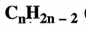
	- 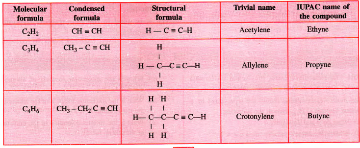
-
- ## Isomers
	- ### Butyne [position]
-
- ## Ethyne
	- ### Formula: $$\ce {C2H2}$$
	- ### Structure $$\ce {H-C≡C-H}$$ [Shape is linear]
	- ### Lab Prep
		- 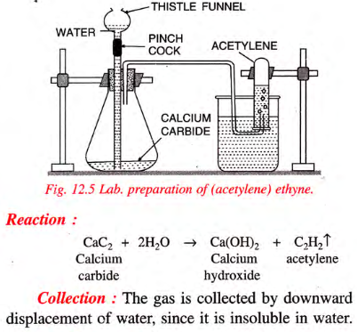
		- Purification with Water, Phosphine taken out by passing through acid. Copper Sulphate or acid. Potassium Dichromate
	- 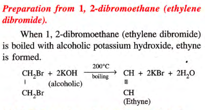
	- ### Physical Properties of Ethyne
		- Colourless, ether-like odour when pure.
		- Negl. solb. in water, highly in org solv.
		- Lighter than air **Var Dens = 13**
		- Liquefies at -84C, BP -75C
	- ### Chemical Properties of Ethyne
		- #### 1. Oxidation of Ethyne (combustion)
			- Sooty Flame
			- Burns in excess air w/ white flame
			- $$\ce {2CH≡CH + 5O2 -> 4CO2 + 2H2O + Heat}$$
		- #### 2. Catalytic Hydrogenation
			- 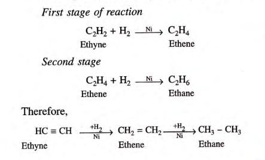
		- #### 3. Halogenation
			- **Chlorine:**
				- 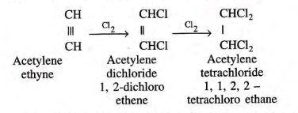
				  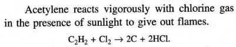{:height 54, :width 379}
			- **Bromine:**
				- 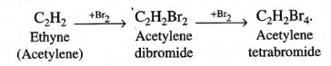
				- **BROWN COLOUR DISAPPEARS DUE TO ADDITION PRODUCTS**
			- **Iodine:**
				- 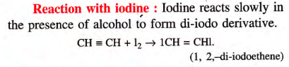
		- #### 4. $$\ce{HCl}$$
			- 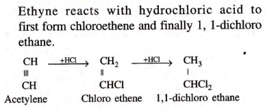
		- #### 5. $$\ce{O3}$$
			- 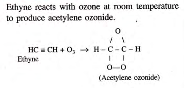