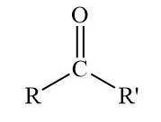
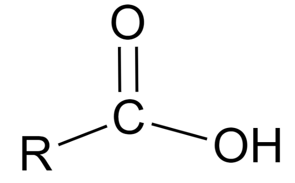
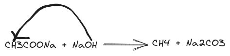

# Intro to Organic Chemistry
- Organic Chemistry can be divided to two entities
	- Aromatic Compounds (like C_{6}H_{6})
		- Aromatic Compounds are also known as cyclic or closed chains.
		- 
	- Non-aromatic Compounds (like CH_{4}, C_{2}H_{4}, etc.)
		- Non-aromatic Compounds can be straight or branched chain.
		- 
-
- ## Nomenclature
  |No. of Carbon Atoms|Name of the thing|
  |--|--|
  |One|Meth-|
  |Two|Eth-|
  |Three|Prop-|
  |Four|But-|
  |Five|Pent-|
  |Six|Hex-|
  |Seven|Hept-|
  |Eight|Oct-|
  |Nine|Non-|
  |Ten|Dec-|
- |No. of Bonds|Name of the thing|
  |--|--|
  |-|-ane|
  |=|-ene|
  |≡|-yne|
  
  Hydrogen will always be in a **single bond**.
-
- ## Catenation property of Carbon
	- Carbon can form *really* long chains using its catenation property.
	- It doesn't have any limit to how many Carbons can attach.
	- Carbon also has a valency of 4.
	- Any empty bonds will aggregate between two Carbon atoms
	  
-
- ## Aromatic Compounds
	- Let's look at the structure of Benzene.
	- {:height 200, :width 200}
	- This is the normal way you would write it. The lines after the hexagon are double bonds.
		- It being a hexagonal structure, we can say that the formula is C_{6}H_{6}
		- It can also be deconstructed, like so:
		- 
		- Now, we can see each Hydrogen and Carbon atom.
		- As it is a cyclic compound, it can also resonate and change the position of the bonds, totally clockwise. It being called a resonant structure.
-
- ## Saturation and Unsaturation
	- A saturated or unsaturated compound can be determined by the number of Hydrogen atoms present in the compound.
	- A saturated compound is where no more hydrogen can be accommodated. z.B.: Alkane
	- An unsaturated compound is where more hydrogen atoms *can* be accommodated. z.B.: Alkene, Alkyne.
-
- ## Functional Groups
	- A chemical group present in the organic compound and which determines the characteristic of the organic compound.
	- z.B.:
		- -COOH [Carboxylic Acid]
		- -CHO [Aldehyde]
		- Ketone
		  
		- -NH_{2} [Amine]
		- -OH [Hydroxyl]
		- -CH_{3} [Methyl]
		- USW.
	- ### Carboxylic Group
		- {:height 124, :width 197}
		- General Formula: C_{n}H_{2n+1}COOH
		- Naming: -oic Acid
		- z.B.: CH_{3}COOH
	- ### Alcoholic Group
		- R-OH
		- General Formula: C_{n}H_{2n+1}OH
		- Naming: -ol
		- z.B.: CH_{3}OH
	- ### Aldehydic Group
		- {:height 138, :width 114}
		- General Formula: C_{n}H_{2n+1}CHO
		- Naming: -al
		- z.B.: CH_{2}O
	- ### Ketonic Group
		- {:height 157, :width 138}
		- General Formula: C_{n}H_{2n+1} - C - C_{n}H_{2n+1}
		- Naming: -one
		- z.B.: Propanone
	- ### Ether Group
		- - O -
		- General Formula: C_{n}H_{2n+1} - O - C_{n}H_{2n+1}
		- Naming: -oxy -ane
		- z.B.: Methoxy Methane
-
- ## Isomerism
	- It is defined as a compound having the same molecular formula but different structure.
	- 
	- Here, Dimethyl ether is an isomer of Ethanol.
	- 
	  {{renderer :mermaid_uugyvnpnfb}}
	- ### Stereoisomer
		- Rearrangement of Atoms
	- ### Structural Isomer
		- Rearrangement of Molecules
	- ### Chain Isomerism
		- Different arrangement of Carbon Atoms
	- ### Position Isomerism
		- Different position of bonds.
		- $$\ce {CH3COONa + NaOH ->[\ce{CaO}] CH4 + Na2CO3}$$
		- {:height 124, :width 473}
- ## Halide Functional Groups
	- -OH
	- -Br
	- -Cl
	- -I [iodine]
	- They are also electrophile.