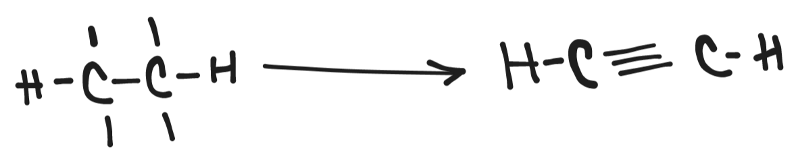

# Intro to Organic Chemistry
- Organic Chemistry can be divided to two entities
	- Aromatic Compounds (like C_{6}H_{6})
		- Aromatic Compounds are also known as cyclic or closed chains.
		- 
	- Non-aromatic Compounds (like CH_{4}, C_{2}H_{4}, etc.)
		- Non-aromatic Compounds can be straight or branched chain.
		- 
-
- ## Nomenclature
  |No. of Carbon Atoms|Name of the thing|
  |--|--|
  |One|Meth-|
  |Two|Eth-|
  |Three|Prop-|
  |Four|But-|
  |Five|Pent-|
  |Six|Hex-|
  |Seven|Hept-|
  |Eight|Oct-|
  |Nine|Non-|
  |Ten|Dec-|
- |No. of Bonds|Name of the thing|
  |--|--|
  |-|-ane|
  |=|-ene|
  |≡|-yne|
  
  Hydrogen will always be in a **single bond**.
-
- ## Catenation property of Carbon
- Carbon can form *really* long chains using its catenation property.
- It doesn't have any limit to how many Carbons can attach.
- Carbon also has a valency of 4.
-
- Any empty bonds will aggregate between two Carbon atoms
  
-
-