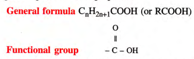
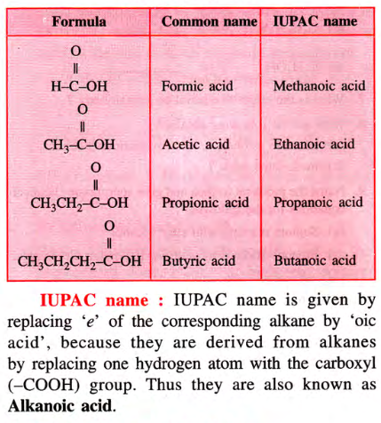
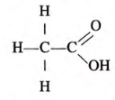
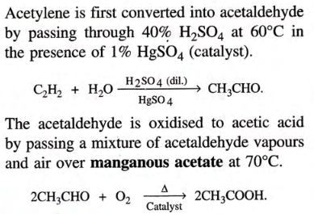
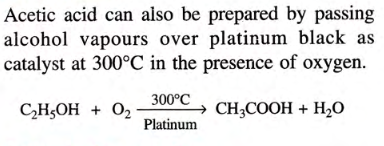
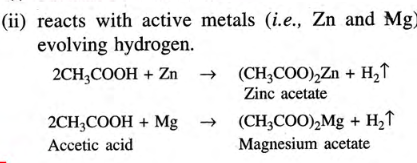
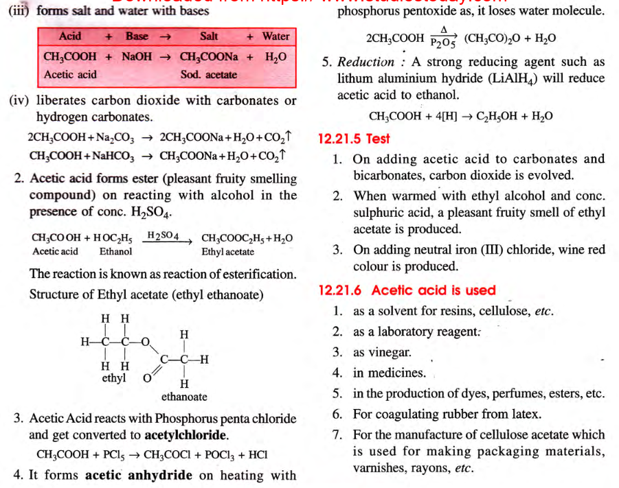

## Definition
	- ### Organic Compound containing $$\ce{-COOH}$$
	- 
	- ### 1 Group: monocarboxylic
	- ### 2 Group: dicarboxylic
- 
-
- ## Acetic Acid $$\ce{CH3COOH}$$
	- ### Structural Formula
		- 
	- ### Lab Preparation
		- Acetic acid can be prepared in the lab by **oxidation** of **ethanol** or **acetaldehyde** with acidified **potassium dichromate** or acidified **sodium dichromate** [Anything that gives out **Nascent Oxygen**]
		- Formula: $$\ce{CH3CH2OH ->[(O)] CH3CHO ->[(O)] CH3COOH}$$
	- ### Manufacture
		- #### **Acetylene**
			- 
		- #### **Ethanol**
			- 
	- ### Physical Properties
		- Colourless
		- Pungent
		- BP 118C
		- Acid on cooling forms crystalline mass resembling ice, melting point 17C, called glacial acetic acid
		- Hygroscopic, sp. gr. at 0C is 1.08
		- Miscible with water, alc, ether
	- ### Chemical Properties
		- Weak Acid
		- Turns blue litmus red
		- 
		- 
		-